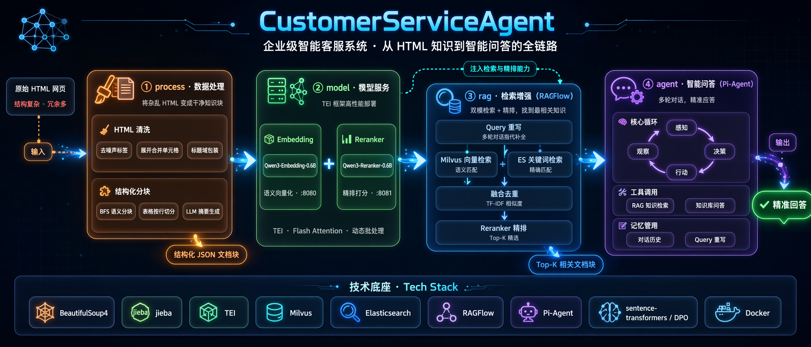
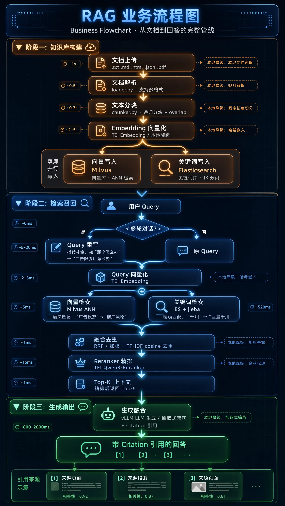

# 🤖 CustomerServiceAgent

> 🏢 面向企业级电商场景的智能客服系统 —— 打通「原始 HTML 知识」→「RAG 检索」→「Agent 问答」的全链路解决方案。

<p align="center">
  
  
  
  
  
  
</p>

---

## 📑 目录导航

- [📖 项目简介](#-项目简介)
- [🧩 RAG 与 Agent 的职责划分与调用关系](#-rag-与-agent-的职责划分与调用关系)
- [🎯 重点与难点](#-重点与难点核心看点)
- [🏗️ 技术架构详解](#️-技术架构详解)
  - [📦 process — HTML 数据处理与分块](#-process--html-数据处理与分块)
  - [🤖 model — 模型推理与训练](#-model--模型推理与训练)
  - [🔍 rag — RAG 检索增强生成](#-rag--rag-检索增强生成)
  - [💬 agent — 智能体框架](#-agent--智能体框架)
- [🚀 快速开始](#-快速开始)
- [📋 项目状态](#-项目状态)
- [🎬 Demo 展示](#-demo-展示)

---

## 📖 项目简介

许多企业沉淀了海量以 **HTML 网页**形式存在的运营知识（电商平台规则、帮助中心文档、产品政策、投放指南等）。这些网页有三大天然缺陷：

- **结构杂乱**：大量 `<div>` 深层嵌套、`<nav>`/`<footer>`/`<svg>` 等无内容标签、模板残留文本、隐藏元素；
- **信息密集**：复杂表格（含 `colspan`/`rowspan` 合并单元格）、图文混排，纯文本抽取会破坏语义；
- **难以检索**：直接切块会割裂标题与正文的从属关系，导致召回不准、答非所问。

如果把这些原始网页直接喂给大模型，会遇到 **上下文超长、噪声干扰、语义割裂** 三重问题，最终表现为「答不准、答不全、答非所问」。

**CustomerServiceAgent** 是一套端到端方案，完整覆盖从「原始 HTML 网页」到「用户精准问答」的全流程：

| 痛点 | 对应模块 | 解决思路 |
|------|---------|---------|
| HTML 结构杂乱、无法直接检索 | 📦 `process/` | 对标 **HtmlRAG** 论文做无损清洗 + Block Tree 语义分块，保留 HTML 结构 |
| 模型推理慢、部署复杂 | 🤖 `model/` | 用 **TEI** 框架一键部署 Qwen3 Embedding/Reranker，Flash Attention 加速 |
| 检索不精准、召回率低 | 🔍 `rag/` | 自研向量 + 关键词双模检索 + 融合去重 + Reranker 精排（Milvus/ES/TEI，均含本地降级实现） |
| 客服机器人无法多轮对话、不会调用工具办事 | 💬 `agent/` | 基于生产级多智能体框架 **hello-agents** 构建，具备工具调用、上下文工程、会话持久化等能力 |

### 🔄 全流程架构图



#### 架构说明

项目围绕「原始 HTML 知识 → 结构RAG 检索 → Agent 问答」主线，分为四层：**process** 对 HTML 做无损清洗与 Block Tree 语义分块，输出结构化 JSON 知识块；**model** 通过 TEI 框架一键部署 Qwen3-Embedding（端口 8080）与 Qwen3-Reranker（端口 8081）两个推理服务，同时支持 SFT + DPO 两阶段微调；**rag** 作为独立 FastAPI 服务（端口 8090），执行"向量检索 + 关键词检索 → RRF 融合去重 → Reranker 精排 → 生成融合"完整管线，每个组件均含本地降级实现、零外部依赖即可运行；**agent** 基于 hello-agents 框架，以 ReActAgent 循环编排多轮对话，通过 Tool Call 按需调用 rag 服务。各模块职责单一、接口清晰，任一模块可独立替换。

### 🎯 核心能力一览

| 能力 | 模块 | 一句话说明 |
|------|------|------|
| 🧹 HTML 清洗与分块 | `process/` | 移除噪声标签、展开合并单元格、BFS 语义分块、LLM 摘要生成 |
| 🤖 模型推理部署 | `model/` | TEI 部署 Qwen3-Embedding + Qwen3-Reranker，双 API 一体化 |
| 🎓 模型微调优化 | `model/` | SFT 监督微调（多级标注 0/1/2）+ DPO 偏好优化 |
| 🔍 RAG 检索增强 | `rag/` | 双模检索（向量+关键词）融合去重后 Reranker 精排；提供 FastAPI 后端 + 轻量前端 + Agent 友好文档 |
| 💬 智能问答框架 | `agent/` | hello-agents：ReAct/Reflection/Plan-Solve 多范式、工具调用、上下文工程、会话持久化、Skills 知识外化 |

---

## 🧩 RAG 与 Agent 的职责划分与调用关系

> 本项目采用**服务与框架分离**的架构：`rag/` 是一个**独立部署的 HTTP 服务**（有自己的进程、端口、数据），`agent/` 是一个**智能体框架**（编排多轮对话与工具调用），二者通过**工具调用（Tool Call）**协议连接，而非直接函数导入耦合。

| 维度 | `rag/`（检索服务） | `agent/`（智能体框架） |
|------|---------------------|--------------------------|
| **职责** | 知识库管理（文档上传/索引） + 检索（向量+关键词融合精排） + 生成（基于上下文回答） | 多轮对话管理、工具调用决策、上下文工程、会话持久化 |
| **对外形态** | 独立 FastAPI 服务（`rag/api/main.py`），暴露 `/api/retrieve`、`/api/chat` 等 REST 接口 | Python 库（`hello_agents` 包），由业务代码 import 后编排 |
| **技术栈** | FastAPI + Milvus/ES/TEI/vLLM（或本地降级实现） | hello-agents（`SimpleAgent`/`ReActAgent`/`ReflectionAgent`/`PlanSolveAgent`） |
| **调用入口** | HTTP：`POST /api/retrieve`、`POST /api/chat`；或直接 Python 调用 `rag.pipeline.retrieve()`/`answer()` | `ReActAgent.run(query)` |
| **启动脚本** | `scripts/run_RAGserver.sh` | `scripts/run_AGTserver.sh` |

**推荐集成方式（Tool-based，见 [TODO.md](TODO.md) 难点追踪）**：将 `rag.pipeline.retrieve()`（或对 `rag/api` 的 HTTP 调用）封装为一个 hello-agents `Tool` 子类，注册进 `ToolRegistry`，交由 `ReActAgent` 在多轮对话中自主判断"是否需要检索"并调用——这样 `rag/` 服务可以独立开发、测试、部署、扩容，`agent/` 只需持有一个工具接口，两者松耦合、可分别演进。RAG 侧的适配器已提供在 `rag/integration/`：`agent_integration.py`（`rag_retrieve_tool`/`rag_answer_tool`，不抛异常、返回结构化结果）+ `tool_usage.py`（OpenAI Function Calling 风格的工具 Schema + `dispatch_tool_call()`），Agent 侧只需在 `ToolRegistry` 中注册这两个函数即可完成对接。

> 📌 **当前状态**：`rag/` 服务已完整可用（可独立启动并通过浏览器/接口体验问答）；`agent/` 框架已引入且自带测试通过；`rag/integration/` 已提供 RAG 侧的工具适配器与调用 Schema，**Agent 侧将其注册进 `ToolRegistry` 的接线代码尚待编写**，是 M4 里程碑的核心待办（详见 [TODO.md](TODO.md)）。

---

## 🎯 重点与难点（核心看点）

> 本节是理解本项目**技术含金量**的关键。下表按「实现难度 × 业务价值」排序，⭐ 越多代表越是核心攻坚点。

| 难点 | 所在模块 | 难度 | 状态 |
|------|---------|:----:|:----:|
| ① HTML 无损清洗与结构化分块（对标论文） | `process/` | ⭐⭐⭐⭐⭐ | ✅ |
| ② 复杂表格展开与图文混合内容分离 | `process/` | ⭐⭐⭐⭐ | ✅ |
| ③ 中文电商领域的分词与去重适配 | `process/` | ⭐⭐⭐ | ✅ |
| ④ Reranker 训练数据构造（困难负样本 + DPO） | `model/` | ⭐⭐⭐⭐ | ✅ |
| ⑤ 向量 + 关键词双模检索融合 | `rag/` | ⭐⭐⭐⭐ | ✅ |
| ⑥ **RAG 如何注册给 Agent 按需调用** | `agent/` | ⭐⭐⭐⭐⭐ | 🔄 框架就位，集成待开发 |
| ⑦ 端到端可量化评测体系 | 全局 | ⭐⭐⭐⭐ | 🔲 |

下面对最核心的几个难点展开说明。

### 🔥 难点①：HTML 无损清洗与结构化分块

这是整个项目的地基，直接对标 [HtmlRAG (TheWebConf 2025)](https://arxiv.org/abs/2411.02959) 论文实现。核心矛盾是——**既要移除噪声，又不能破坏语义结构**。

- **无损结构压缩**：多层单嵌套 `<div><div><p>文本</p></div></div>` 自底向上合并为 `<p>文本</p>`，同时**保留** `<h1>~<h6>` 标题层级（包装为 `hN_domain`），保证「标题—正文」从属关系不丢失。
- **Block Tree + 粒度控制**：用 **BFS** 遍历 DOM（对标论文 Algorithm 1），通过 `max_node_words` / `min_node_words` 双阈值控制块粒度——太大超上下文、太小丢语义，需要在拆分与合并之间动态权衡；对超阈值节点继续下钻，对裸文本（直接附属于节点、不在子标签内的文本）单独成块以避免信息丢失。
- **保留 HTML 结构（论文核心观点）**：输出同时携带 `text`（纯文本）、`html_content`（保留标签结构）与 `block_path`（如 `html>body>div0>p`，唯一标识块，可用于后续剪枝）。论文核心结论正是 **"HTML is Better Than Plain Text"**。

### 🔥 难点②：复杂表格展开与图文混合内容分离

电商知识库表格密集，是抽取质量的重灾区：

- **合并单元格展开**：将 `colspan` / `rowspan` 还原为标准矩阵，忽略 `0` 值占位单元格，保证每一行都能独立被检索命中；
- **按行切分且每块带表头**：长表格按行切分为多个块，**每个块都以表头开头**，使单块脱离上下文也可被理解；单行超长时强制独立成块；
- **混合内容分离**：同一区块内的「正文 + 表格」被分别提取为不同文档块（`_extract_mixed_content`），避免表格挤占正文语义。

### 🔥 难点④：Reranker 训练数据构造与 SFT → DPO

排序质量取决于训练数据质量，本项目在数据构造上做了三层设计：

- **多级相关性标注**：用 LLM 对候选文档打 `0/1/2`（无关 / 部分相关 / 高度相关），比单纯二分类信息量更大；
- **困难负样本**：从**同页面不同段落**采样——主题相近但内容不同，最能锻炼模型的区分力；辅以随机负样本作为基础对照；
- **两阶段训练**：先 **SFT** 学「绝对相关性分数」，再 **DPO** 在偏好对（chosen vs rejected）上学「相对排序」，无需显式奖励模型，收敛更稳。

### 🔥 难点⑤：向量 + 关键词双模检索融合

`rag/` 自研实现，核心是让语义检索（Milvus）和精确检索（Elasticsearch）的结果可比较、可合并：

- **RRF（Reciprocal Rank Fusion）**：`score = Σ 1/(k+rank)`，无需归一化分数，鲁棒性好，为默认策略；
- **加权融合**：对各路分数 Min-Max 归一化后按配置权重线性相加，适合已知两路可信度差异的场景；
- **融合去重**：复用 `process/` 的 TF-IDF + cosine 相似度去重逻辑，按时间保留最新版本，避免同一知识块在两路都命中时重复出现。

### 🔥 难点⑥：RAG 如何注册给 Agent（本项目最大挑战，持续追踪）

> 这是打通「检索能力」与「智能体决策」的关键，也是目前仍在攻坚的核心问题。

需要回答：**Agent 何时、以何种方式调用 RAG？** 目前规划三条候选路径：

| 方案 | 思路 | 适用 |
|------|------|------|
| A. Tool-based | 将 RAG 检索封装为 hello-agents `Tool`，通过 function calling 调用 | 复杂问题、需模型自主判断（推荐） |
| B. Middleware | RAG 作为感知层中间件，自动注入检索结果 | 高频、确定性问答 |
| C. Hybrid | 常见问题自动检索 + 复杂问题 Agent 主动调用 | 生产综合场景 |

难点在于**触发策略**：过度检索会拖慢响应、引入噪声；漏检索则答非所问。详见 [TODO.md](TODO.md)。

### 🔥 难点⑦：端到端可量化评测体系

缺乏统一评测，就无法判断「每一次修改」到底带来了正收益还是负收益。规划了**四层评测体系**：

| 层级 | 评测对象 | 指标 |
|------|---------|------|
| Layer 1 | 数据处理质量 | 噪声残留率 / 内容保留率 / 压缩比 / 分块合理性 |
| Layer 2 | 检索召回质量 | Recall@K / MRR / NDCG@K / 延迟 P95 |
| Layer 3 | 精排质量 | Top-1 命中率 / 排序改善幅度 |
| Layer 4 | 端到端回答 | Accuracy / Faithfulness / Relevance（LLM-as-Judge） |

---

## 🏗️ 技术架构详解

### 📦 process — HTML 数据处理与分块

对标 [HtmlRAG](https://arxiv.org/abs/2411.02959)（TheWebConf 2025）论文实现，核心算法与论文一致。

> **职责边界**：只负责"把杂乱的 HTML 网页变成干净的结构化知识块"，**不涉及**数据库插库与检索查询（交给 `rag/`）。这种单一职责设计让 process 可独立测试、独立复用。

#### 阶段 1：HTML 清洗 🧹

| 清洗规则 | 说明 |
|---------|------|
| 噪声标签移除 | `script` / `style` / `svg` / `nav` / `aside` / `footer` / `head` / `title` / `meta` / `input` / `button` 等 |
| 隐藏元素移除 | `display:none` / `visibility:hidden` / `.hidden` class |
| 模板文本清除 | `{{PLACEHOLDER}}` 等模板残留（仅替换占位符，保留正常文本） |
| 空标签清理 | 完全空标签、仅含空白、仅含 `<br>` 的标签 |
| 表格展开 | `colspan` / `rowspan` 合并单元格 → 标准矩阵 |
| 冗余包装展开 | 多层单嵌套 `<div><div><p>` → `<p>`（自底向上迭代 3 轮） |
| 标题域包装 | `<h1>`~`<h6>` 按层级包装为 `<div class="hN_domain">` |
| 不可见字符清理 | 零宽字符、控制字符 |

#### 阶段 2：结构化分块 🧩

| 算法 | 说明 |
|------|------|
| Block Tree 构建 | BFS 广度优先遍历 DOM（对标论文 Algorithm 1） |
| 粒度控制 | `max_node_words`（最大词数）+ `min_node_words`（最小词数），中文按字符计 |
| 裸文本块 | 节点被拆分时，直接附属文本单独成块，避免信息丢失 |
| Heading 拆分 | 按 H1~H6 层级切为独立内容块（`_find_heading_parent` 穿透 wrapper） |
| 表格按行切分 | 每个块以表头开头，长行强制独立成块 |
| 混合内容分离 | 文本与表格分别提取为不同文档块 |
| UI 噪声过滤 | 进度条、导航文本（`0%`/`PROGRESS`/`目录` 等）不进入文档块 |

**输出格式**（每个文档块）：
```json
{
  "chunk_idx": 0,
  "page_name": "页面名称",
  "title": "段落标题",
  "page_url": "来源路径",
  "text": "纯文本内容",
  "html_content": "<div><p>保留 HTML 结构（论文核心：HTML 优于纯文本）</p></div>",
  "block_path": "html>body>div0>p",
  "summary": "LLM 生成的一句话摘要",
  "question": "代表性用户问题",
  "time": "文档时间戳"
}
```

> 💡 **中文适配要点**：`jieba_util.py` 会从 HTML 语料中提取高频短语（如"巨量千川""广告限流"）构建领域词典，显著提升分词与关键词检索的准确率；分块统计词数时按**字符**计数（`zh_char=True`）而非空格分词。

> 💡 **去重要点**：`deduplicate_ranked_blocks_pal` 用 TF-IDF + cosine 相似度识别重复块，再用**连通分量 BFS**（而非递归 DFS，避免大集群栈溢出）聚簇，簇内按 `time` 保留最新版本。

---

### 🤖 model — 模型推理与训练

#### 推理框架选型：TEI

经过对 TEI、vLLM、Infinity、Xinference 四个框架对比，最终选定 **[TEI (Text Embeddings Inference)](https://github.com/huggingface/text-embeddings-inference)**：

| 优势 | 说明 |
|------|------|
| ✅ 明确支持 Qwen3 | 官方支持 Qwen3-Embedding 与 Qwen3-Reranker |
| ✅ 双 API 一体化 | 同时提供 `/embed`（嵌入）与 `/rerank`（重排序） |
| ✅ HuggingFace 官方维护 | Apache-2.0，生产就绪 |
| ✅ 性能最优 | Flash Attention + 动态批处理，吞吐远超 sentence-transformers |
| ✅ 部署简单 | 轻量 Docker 镜像，无需图编译，启动快 |

#### 模型选型

Qwen3-Embedding / Qwen3-Reranker 系列提供 **0.6B / 4B / 8B** 三个尺寸，8B 版本在 MTEB 多语言榜单排名第一（70.58 分）。选型参考：

| 模型 | 用途 | 参数量 | 嵌入维度 | MTEB 多语言 | 推荐场景 |
|------|------|--------|---------|------------|---------|
| **Qwen3-Embedding-4B** | 文本嵌入 | 4B | 2560 | **69.45** | **生产推荐（精度/速度平衡）** |
| **Qwen3-Reranker-4B** | 重排序 | 4B | — | — | **生产推荐（精度/速度平衡）** |

#### 模型微调策略（两阶段）

| 阶段 | 脚本 | 训练数据 | 目标 |
|------|------|---------|------|
| **Stage 1: SFT 监督微调** | `reranker_ft.py` | `reranker_qa_pointwise.jsonl`（多级标注 0/1/2） | 学习绝对相关性分数 |
| **Stage 2: DPO 偏好优化** | `reranker_dpo.py` | `reranker_qa_dpo.jsonl`（chosen vs rejected 偏好对） | 在 SFT 基础上学习相对排序偏好 |

| 策略 | Loss 函数 | 优势 |
|------|---------|------|
| SFT | BCE / MSE | 简单稳定，学习绝对分数 |
| DPO | DPO Loss | 偏好对齐好，无需显式奖励模型 |

#### 数据集构造改进

| 改进点 | 说明 |
|--------|------|
| 多级相关性标注 | LLM 对每个文档打 0/1/2 三级分数 |
| 困难负样本 | 同页面不同段落，主题相近但内容不同 |
| 随机负样本 | 明显无关文档，用于基础训练 |
| 三格式输出 | 同时产出 Pointwise / Pairwise / DPO 三种格式 |

---

### 🔍 rag — RAG 检索增强生成

**已完成**，自研检索增强生成框架（索引/检索/融合/精排/生成均可独立替换，非基于第三方 RAG 框架），**以独立 HTTP 服务形式对外提供能力**（详见「RAG 与 Agent 的职责划分」），设计检索链路：




| 能力 | 技术 | 说明 |
|------|------|------|
| 🗄️ 向量检索 | Milvus 2.x + Qwen3-Embedding（默认本地降级：JSON 存储 + numpy 余弦） | 语义理解，"广告投放" 匹配 "推广策略" |
| 🔑 关键词检索 | Elasticsearch 8.x + IK 分词（默认本地降级：jieba + TF-IDF） | 精确匹配，"千川" 匹配 "巨量千川" |
| 🔄 融合去重 | RRF / 加权融合 + TF-IDF cosine 相似度去重 | 消除双模检索的重复结果 |
| 📊 Reranker 精排 | Qwen3-Reranker via TEI（默认本地降级：Embedder 余弦代理） | 从 ~20 个候选中精选 Top-5 |
| 💬 生成融合 | vLLM/OpenAI 兼容 Chat 接口（默认本地降级：抽取式摘录 + Citation） | 基于检索上下文生成带引用的回答 |
| 🌐 服务化 | FastAPI 后端 + 轻量前端（`rag/web/`） | 文档上传（含版本历史）/ 检索测试 / 流式问答 / 监控看板一站式体验，详见 `rag/README.md` |

**核心设计**：每个组件（向量库/关键词库/Embedding/Reranker/生成）都有"真实服务后端"与"本地降级后端"双实现，默认本地降级，**零外部依赖即可跑通全链路**；生产环境通过环境变量切换到 Milvus/ES/TEI/vLLM 真实后端（见 [rag/README.md](rag/README.md)）。

---

### 💬 agent — 智能体框架

基于 **[hello-agents](https://github.com/jjyaoao/HelloAgents)** 构建——一个已引入并可独立运行/测试的生产级多智能体框架，`agent/` 目录即该框架的完整项目工程（`pyproject.toml` + `hello_agents/` 包源码）。

| 能力 | 说明 |
|------|------|
| 🧠 多种 Agent 范式 | `SimpleAgent`（单轮）/ `ReActAgent`（感知→决策→行动→观察循环）/ `ReflectionAgent`（自我反思）/ `PlanSolveAgent`（先规划后执行） |
| 🔧 工具调用系统 | `ToolRegistry` 工具注册与调度、统一响应协议 `ToolResponse`、熔断器（Circuit Breaker）、工具过滤器 |
| 🧵 上下文工程 | 对话历史管理、Token 计数、自动截断/压缩（长对话防爆炸） |
| 💾 会话持久化 | 会话状态保存/加载/列表，支持多轮对话跨进程恢复 |
| 🧩 Skills 知识外化 | `SkillLoader` 动态加载技能包（ASR/TTS/VLM/文档处理等 17 个内置技能） |
| 🔍 可观测性 | `TraceLogger` 记录完整调用链路，便于调试与审计 |
| 🌐 多 LLM Provider | `HelloAgentsLLM` 自动检测 OpenAI 兼容 / Anthropic / Gemini 三种适配器 |

> ⚠️ **当前状态**：框架本身已引入并可用（详见 [agent/README.md](agent/README.md)），自带 19 个测试文件已迁移至 `tests/test_agent/`；**与 `rag/` 服务的工具化集成尚未开发**（是 M4 里程碑的核心待办，见 [TODO.md](TODO.md) 「难点追踪」章节）。

---

## 🚀 快速开始

### 1️⃣ 安装依赖

```bash
# 主项目依赖（process / model / rag）
pip install -r requirements.txt

# Agent 模块依赖（hello-agents 框架，独立管理）
pip install -r agent/requirements.txt
```

> 💡 无需 `pip install -e agent/`：`tests/conftest.py` 已将 `agent/` 目录注入 `sys.path`，
> 直接 `import hello_agents` 即可（等价于开发模式安装但零配置）。若要在 `agent/` 目录外的
> 自有脚本中使用 `hello_agents`，建议正式安装：`pip install -e agent/`。

### 2️⃣ 配置环境

```bash
cp config/config.example.json config/config.json
cp .env.example .env
# 编辑 .env：填写 DEEPSEEK_API_KEY、LLM_MODEL_ID/LLM_API_KEY/LLM_BASE_URL（Agent 用）、各服务地址等
# 编辑 config.json：确认模型配置
```

> **配置优先级**：环境变量 > `.env` 文件 > `config/config.json` > 代码默认值
> **配置分层说明**：见 [.env.example](.env.example) 内的分区注释（通用配置 / process 专属 / rag 专属 / agent 专属 / 开发与生产环境区分）

### 3️⃣ 部署模型服务（可选，无 GPU/未部署时 rag/ 自动降级为本地实现）

```bash
# 方式一：一键启动脚本（推荐，含 Docker/GPU 环境检查 + 健康检查）
bash scripts/start_tei.sh

# 方式二：手动 Docker Compose
cd model/inference
docker compose -f docker-compose-tei.yml up -d

# 验证服务
curl http://localhost:8080/health   # Embedding 服务
curl http://localhost:8081/health   # Reranker 服务

# 停止服务
bash scripts/start_tei.sh --down
```

> **启动顺序**：TEI 是 RAG 服务的上游依赖，但 rag/ 设计了优雅降级——
> TEI 不可用时自动降级为本地哈希嵌入 + 余弦代理精排，不影响服务启动。
> TEI 就绪后 rag/ 会自动开始使用真实模型服务。

### 4️⃣ 处理 HTML 数据

所有输出统一存放在 `process/data/` 目录下（文件夹级后缀 `_cleaned` / `_blocked`，保留子目录结构）。

```bash
# 将 HTML 文件放入 process/data/数据集名/
# 一键运行全流程（清洗 + 分块）
HTML_SOURCE=process/data/抖音电商规则中心 bash scripts/process_HTMLdata.sh

# 或使用 main.py 灵活控制（PYTHONPATH 需同时包含 process 与 process/src）
export PYTHONPATH=process:process/src

# 全流程（清洗 + 分块）
python -m main --source-dir process/data/抖音电商规则中心

# 仅清洗
python -m main --source-dir process/data/抖音电商规则中心 --step clean

# 仅分块（需先完成清洗）
python -m main --html-dir process/data/抖音电商规则中心_cleaned --step block

# 输出：
#   process/data/抖音电商规则中心_cleaned/   ← 清洗后 HTML
#   process/data/抖音电商规则中心_blocked/   ← 分块后 JSON
```

### 5️⃣ 模型微调（可选）

```bash
# Step 1: 构造训练数据（已接入 rag.retrieval 真实召回）
PYTHONPATH=. python -m model.utils.build_dataset \
    --milvus-host 127.0.0.1 \
    --collection-name htmlrag_dev \
    --output-dir dataset/

# Step 2: SFT 监督微调
PYTHONPATH=. python -m model.trainer.reranker_ft

# Step 3: DPO 偏好优化（在 SFT 基础上）
PYTHONPATH=. python -m model.trainer.reranker_dpo
```

### 6️⃣ 下载评测数据集（可选，用于快速体验 RAG 效果）

```bash
# 预处理脚本自动从 HuggingFace 下载 Bitext 电商客服数据集并生成知识库块
python tests/experiment/preprocess.py

# 导入知识库到 RAG 系统
python -c "
import json
from rag.knowledge_base import corpus_management
blocks = json.load(open('tests/experiment/kb_blocks.json', encoding='utf-8'))
corpus_management.ingest_blocks(blocks, filename='bitext_customer_support.json')
"

# 一键端到端评测（自动预处理→导入→运行31条用例→输出报告）
python tests/experiment/run_eval.py
```

> 数据集详情见 [dataset/README.md](dataset/README.md)：Bitext Customer Support（26,872 条 QA 对，覆盖 ORDER/REFUND/PAYMENT/DELIVERY 等 11 个类别 27 个意图）。

### 7️⃣ 启动 RAG 服务（检索 + 问答）

```bash
# 一键启动脚本：自动检查 Python 环境/依赖/配置文件，再启动服务
bash scripts/run_RAGserver.sh

# 等价于（脚本内部会先构建索引，再启动服务）：
#   bash scripts/build_index.sh      # 读取 process/ 输出的知识块 JSON，写入向量库+关键词库
#   bash scripts/run_RAGserver.sh    # 启动 FastAPI 后端（含前端页面）

# 打开浏览器访问 http://localhost:8090/ui/ 体验文档上传 + 问答 + 检索测试
# Swagger 接口文档: http://localhost:8090/docs
# Agent 友好接口文档: rag/docs/API_REFERENCE.md
```

> 生产环境切换到真实 Milvus/ES/TEI/vLLM 服务的方法见 [rag/README.md](rag/README.md#快速开始)。

### 8️⃣ 启动 Agent 服务

```bash
# 一键启动脚本：自动检查 hello_agents 是否可导入、LLM_API_KEY 是否配置
bash scripts/run_AGTserver.sh
```

> 当前 `agent/` 与 `rag/` 服务的工具化调用尚未接线（见「RAG 与 Agent 的职责划分」），
> `run_AGTserver.sh` 目前用于启动/验证 hello-agents 框架自身（示例见 `agent/examples/`）。

### 9️⃣ 运行测试

```bash
# 运行全部测试（process + rag + agent，统一入口，无需手动设置 PYTHONPATH）
pytest tests/ -v

# 或分模块运行
pytest tests/test_process/ -v
pytest tests/test_rag/ -v
pytest tests/test_agent/ -v      # 部分用例需先在 .env 配置 LLM_API_KEY 才能完整通过
```

---

## 📋 项目状态

| 模块 | 状态 | 进度 | 说明 |
|------|------|------|------|
| 📦 process/ | ✅ 完成 | 100% | 对标 HtmlRAG 论文，单元测试覆盖（`tests/test_process/`） |
| 🤖 model/ | ✅ 基础完成 | 80% | TEI 客户端 + SFT/DPO 训练代码（待实际部署验证） |
| 🔍 rag/ | ✅ 完成 | 100% | 索引/检索/融合/精排/生成 + FastAPI 后端 + 前端 + 文档 + 测试全交付，已完成全组件代码审计与性能优化 |
| 💬 agent/ | 🔄 框架就位 | 40% | hello-agents 生产级框架已引入 + 自带测试迁移完成；与 rag/ 的工具化集成待开发（M4 核心） |
| 🧪 tests/ | ✅ 模块化完成 | 90% | 按模块拆分为 `test_process/`（10）+ `test_rag/`（42，按 rag/ 7 个子模块 + 跨模块组合分文件）+ `test_agent/`（19），统一 `conftest.py` 入口 |
| 📊 评测体系 | ✅ 基础完成 | 50% | Bitext 电商客服数据集（26,872 条 QA / 11 类别 27 意图），本地降级后端召回率 **93.5%**（31 条评测用例），平均延迟 574ms；详见 [dataset/README.md](dataset/README.md) |

详见 [TODO.md](TODO.md)。

---

## 📄 License

本项目仅供学习和研究使用。引用的开源项目（HtmlRAG、TEI、FastAPI、hello-agents 等）请遵循各自许可证；`agent/` 目录下的 hello-agents 框架许可证为 CC-BY-NC-SA-4.0，详见 [agent/LICENSE](agent/LICENSE)。

---

## 🎬 Demo 展示

<!-- [Optimized] 新增 Demo 展示区：服务运行界面与 API 调用示例 -->

### 前端界面

启动 `bash scripts/run_RAGserver.sh` 后访问 `http://localhost:8090/ui/`：

- **文档上传**：支持拖拽上传 `.txt` / `.md` / `.html` / `.json` / `.pdf`，自动解析分块并写入索引
- **问答交互**：输入问题即时获得带 Citation 引用的回答，底部展示引用来源与分数
- **检索测试**：输入查询查看原始检索到的文档块与相关性分数，用于调试检索效果

### API 调用示例

```bash
# 1. 健康检查
curl http://localhost:8090/api/health

# 2. 上传文档
curl -X POST http://localhost:8090/api/documents/upload \
  -F "file=@dataset/test_doc.txt"

# 3. 检索问答上下文
curl -X POST http://localhost:8090/api/retrieve \
  -H "Content-Type: application/json" \
  -d '{"query": "如何取消订单", "top_k": 5}'

# 4. 端到端问答（含生成）
curl -X POST http://localhost:8090/api/chat \
  -H "Content-Type: application/json" \
  -d '{"query": "退款政策是什么"}'

# 5. 流式问答（SSE）
curl -N http://localhost:8090/api/chat/stream \
  -X POST -H "Content-Type: application/json" \
  -d '{"query": "订单超时未送达怎么办"}'

# 6. 知识库统计
curl http://localhost:8090/api/documents
```

### Swagger UI

完整的交互式 API 文档（含请求/响应 Schema、错误码、在线测试）：

- **Swagger UI**：`http://localhost:8090/docs`
- **Agent 友好文档**：`rag/docs/API_REFERENCE.md`（纯文本格式，适合自动化解析）
- **OpenAPI JSON**：`rag/docs/openapi.json`（静态导出，离线可用）
