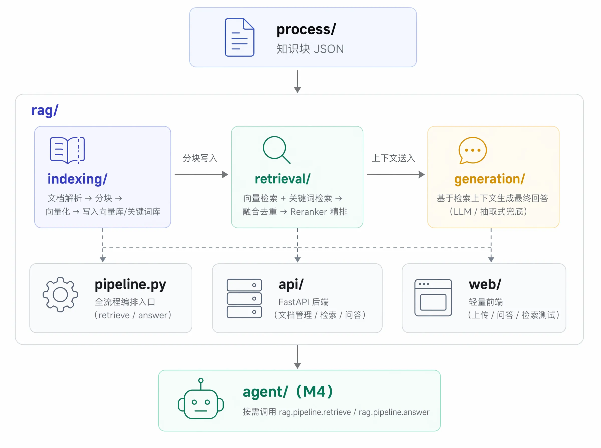

# 🔍 rag/ —— RAG 检索增强生成模块

> 对齐 `TODO.md` M3 里程碑：打通「知识块 → 向量化/关键词索引 → 双模检索 → 融合去重 →
> Reranker 精排 → 生成融合」全链路，并提供开箱即用的 FastAPI 后端与轻量前端。

---

## 📑 目录

- [模块定位](#模块定位)
- [核心设计：真实服务 vs 本地降级](#核心设计真实服务-vs-本地降级)
- [快速开始](#快速开始)
- [配置项](#配置项)
- [Python API 用法](#python-api-用法)
- [与 process/ 的对接](#与-process-的对接)
- [与 model/ 的对接](#与-model-的对接)
- [测试](#测试)
- [已知限制](#已知限制)

---

## 模块定位



每个子模块职责单一、接口清晰，**任一组件可独立替换**而不影响其它模块（详见下节）。

---

## 核心设计：真实服务 vs 本地降级

TODO.md 中规划的生产链路依赖 **Milvus + Elasticsearch + TEI（Embedding/Reranker）+ vLLM**。
但这些服务往往不是"随手就有"的，为了让本系统**开箱即用**（不部署任何外部服务也能跑通完整
RAG 全链路）并且**方便单测**（无需 mock 网络请求），每个关键组件都设计了两套后端：

| 组件 | 生产后端（`xxx_backend=...`） | 本地降级后端（默认） | 切换方式 |
|------|------------------------------|----------------------|---------|
| 向量库 | `milvus`（Milvus 2.x + HNSW/COSINE） | `local`（JSON 持久化 + numpy 暴力余弦检索） | `RAG_VECTOR_BACKEND=milvus` |
| 关键词库 | `es`（Elasticsearch + IK 分词 + `build_optimal_jieba_query`） | `local`（jieba 分词 + TF-IDF 余弦相似度） | `RAG_KEYWORD_BACKEND=es` |
| Embedding | `tei`（对接 `model/inference/tei_client.py`） | `local`（特征哈希 Hashing Trick，确定性、无需训练） | `RAG_EMBED_BACKEND=tei` |
| Reranker | `tei`（TEI 交叉编码精排） | `local`（Embedder 余弦相似度代理） | `RAG_RERANK_BACKEND=tei` |
| 生成 | `vllm`（OpenAI 兼容 Chat 接口，走 `config.json` 的 `vllm_api_url`） | `local`（抽取式摘录回答，不调用任何 LLM） | `RAG_GENERATION_BACKEND=vllm` |

**优雅降级**：即使显式配置为生产后端，服务连接失败时也会自动降级并打印告警日志（不会导致
请求 500 报错），例如：
- `embedder.py`：TEI 健康检查失败 → 自动切换本地哈希嵌入
- `reranker.py`：TEI 不可用 → 按 DoD 要求跳过精排，直接返回融合结果
- `generator.py`：vLLM 不可用 → 降级为抽取式摘录回答

> ⚠️ 本地降级实现的检索精度**明显低于**真实的 Embedding/Reranker 模型（哈希嵌入是词袋近似，
> 非真实语义向量），仅用于演示、集成测试与无 GPU 环境下的快速验证。**生产部署务必切换到
> 真实后端**（见下方"生产部署"）。

---

## 快速开始

### 1. 安装依赖

```bash
cd CustomerServiceAgent
pip install -r requirements.txt
```

### 2. 直接启动（本地降级后端，零外部依赖）

```bash
bash scripts/run_RAGserver.sh
# 或: python -m uvicorn rag.api.main:app --host 0.0.0.0 --port 8090 --reload
```

打开浏览器访问：
- 前端页面：http://localhost:8090/ui/
- Swagger UI：http://localhost:8090/docs
- 健康检查：http://localhost:8090/api/health

在前端页面上传一份 `.txt`/`.md` 文档，即可在"问答"标签页体验检索增强问答；"检索测试"
标签页可查看原始检索结果与分数。

### 3. 生产部署（切换到真实服务）

```bash
# 1. 部署 Milvus / Elasticsearch（自行部署或使用云服务）
# 2. 部署 TEI Embedding/Reranker（见 scripts/start_tei.sh 或 model/inference/docker-compose-tei.yml）
bash scripts/start_tei.sh  # 推荐：含健康检查
# 或手动: cd model/inference && docker compose -f docker-compose-tei.yml up -d && cd -

# 3. 配置环境变量（.env，参考 .env.example）
export MILVUS_HOST_DEV=127.0.0.1
export ES_HOST_DEV=127.0.0.1
export TEI_EMBED_URL=http://localhost:8080
export TEI_RERANK_URL=http://localhost:8081
export VLLM_API_URL=http://localhost:8011/v1/chat/completions

# 4. 切换后端
export RAG_VECTOR_BACKEND=milvus
export RAG_KEYWORD_BACKEND=es
export RAG_EMBED_BACKEND=tei
export RAG_RERANK_BACKEND=tei
export RAG_GENERATION_BACKEND=vllm

# 5. 构建索引（从 process/ 输出批量导入）
bash scripts/build_index.sh

# 6. 启动服务
bash scripts/run_RAGserver.sh
```

---

## 配置项

全部配置见 `rag/config.py` 的 `RAG_CONFIG`，可通过环境变量覆盖：

| 环境变量 | 默认值 | 说明 |
|---------|--------|------|
| `RAG_VECTOR_BACKEND` | `local` | `local` / `milvus` |
| `RAG_KEYWORD_BACKEND` | `local` | `local` / `es` |
| `RAG_EMBED_BACKEND` | `local` | `local` / `tei` |
| `RAG_RERANK_BACKEND` | `local` | `local` / `tei` |
| `RAG_GENERATION_BACKEND` | `local` | `local` / `vllm` |
| `RAG_TOP_K_RECALL` | `20` | 单路召回条数 |
| `RAG_TOP_K_FINAL` | `5` | 精排后返回条数 |
| `RAG_FUSION_METHOD` | `rrf` | `rrf` / `weighted` |
| `RAG_FUSION_WEIGHT_MILVUS` / `RAG_FUSION_WEIGHT_ES` | `0.5` / `0.5` | 加权融合权重 |
| `RAG_CHUNK_SIZE` / `RAG_CHUNK_OVERLAP` | `500` / `50` | 通用文本分块大小/重叠 |
| `RAG_UPLOAD_MAX_SIZE_MB` | `20` | 上传文件大小上限 |
| `RAG_DATA_DIR` | `rag/data` | 本地降级后端持久化目录 |
| `MILVUS_HOST_DEV` / `ES_HOST_DEV` / ... | 见 `.env.example` | 复用项目级 `config/config_loader.py` 配置 |

```bash
python -c "from rag.config import RAG_CONFIG; print(RAG_CONFIG)"
```

---

## Python API 用法

除 HTTP 接口外，也可直接在 Python 中调用（如 `agent/` 未来注册 RAG 工具时）：

```python
from rag.pipeline import retrieve, answer

# 仅检索，不生成答案
results = retrieve("广告限流后怎么办", top_k=5)
for r in results:
    print(r["score"], r["title"], r["page_url"])

# 端到端问答
result = answer("广告限流后怎么办")
print(result["answer"])
print(result["citations"])
```

```python
from rag.indexing import indexer

# 导入 process/ 输出的知识块
meta = indexer.ingest_blocks(json.load(open("process/dataset/html_cleaned_block/xxx.json")))

# 导入普通文档（自动分块）
meta = indexer.ingest_file("faq.txt", open("faq.txt", "rb").read())
```

---

## 与 process/ 的对接

- `rag/schema.py` 的字段定义**完全对齐** `process/` 的输出（`chunk_idx/page_name/title/
  page_url/text/html_content/block_path/summary/question/time`），因此 `process/` 产出的
  JSON 可通过 `POST /api/documents/ingest_blocks` 或 `indexer.ingest_blocks()` 直接导入，
  无需转换。
- `rag/retrieval/fusion.py` 的去重复用 `process/src/text_process.py` 的
  `deduplicate_ranked_blocks_pal`（TF-IDF + cosine，按时间保留最新版本）。
- `rag/indexing/es_index.py` 的关键词查询构建复用 `build_optimal_jieba_query`。
- `process/src/html_pruner.py` 的两阶段剪枝（`two_stage_prune`）尚未接入 `rag/pipeline.py`
  （见 TODO.md「深化方向 A」），后续可在精排后、送入生成前对 `html_content` 做剪枝以进一步
  压缩上下文 token。

---

## 与 model/ 的对接

- `rag/indexing/embedder.py` 与 `rag/retrieval/reranker.py` 的 `tei` 后端直接复用
  `model/inference/tei_client.py` 的 `get_tei_client()` 单例。
- `model/utils/build_dataset.py` 中原 `chunks = [res[0]]` 占位已回填为调用
  `rag.retrieval` 的真实双模检索（见该文件顶部注释与 TODO.md T6）。

---

## 测试

```bash
# 运行全部 rag/ 测试（纯本地降级后端，无需任何外部服务）
pytest tests/test_rag_*.py -v

# 运行全部项目测试（process/ + rag/）
pytest tests/ -v
```

测试覆盖：
- `test_rag_config.py` / `test_rag_schema.py`：配置与数据结构
- `test_rag_chunker.py`：分块正常/边界/异常场景
- `test_rag_embedder.py`：本地哈希嵌入确定性 + TEI 降级
- `test_rag_local_vector_index.py` / `test_rag_local_keyword_index.py`：本地存储 CRUD
- `test_rag_fusion.py`：RRF/加权融合排序正确性 + 去重
- `test_rag_reranker.py`：本地精排 + TEI 降级（DoD：服务不可用不崩溃）
- `test_rag_generation.py`：抽取式生成 + vLLM 降级
- `test_rag_indexer.py`：文档上传/导入/删除/统计全流程
- `test_rag_pipeline.py`：`retrieve()`/`answer()` 端到端 + 单路检索失败降级
- `test_rag_api.py`：FastAPI 接口（含错误码、SSE 流式响应）

---

## 已知限制

- 本地降级后端（`local`）不适合大规模生产知识库（`LocalVectorStore` 每次检索做全量暴力
  余弦搜索，`LocalKeywordStore` 每次检索重新拟合 TF-IDF），仅用于演示与中小规模场景。
- 本地哈希嵌入（`local_hash_embedding`）是词袋近似而非真实语义向量，语义理解能力弱于
  Qwen3-Embedding，例如无法识别"广告投放"≈"推广策略"这类同义改写。
- `/api/chat/stream` 当前是"生成完整答案后分段推送"，并非真正的逐 token 流式生成；
  切换到 `vllm` 后端并接入 OpenAI 流式 API 可获得真流式效果（接口契约已预留）。
- `two_stage_prune`（HTML 两阶段剪枝）尚未接入 `pipeline.py`，见「与 process/ 的对接」。
